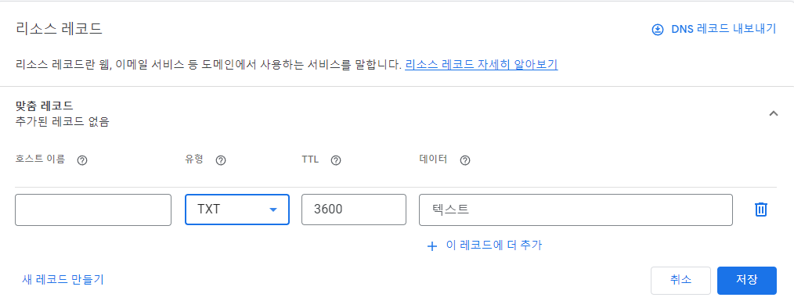

---

---

<h2 id="서론">서론</h2>

HTTP만 사용된 전달은 보호되지 않습니다. 우리가 입력할 아이디와 비밀번호는 평문으로 전달되게 될 것이며 이는 공격자가 쉽게 가로챌 수 있습니다. 
이를 방지하기 위해 지금은 TLS내지 SSL을 사용한 HTTPS가 사용되고 있습니다. 
국내에서는 웹서버 정보제공자가 로그인과 관련된 페이지에서 HTTPS 사용을 의무한 법안이 시행중입니다.

<h3 id="인증서">인증서</h3>

페이지 제공자와 수신자는 CA(인증 기관–업체)를 사이로 아래와 같은 작업을 시행합니다.

<h3 id="lets-encrypt">Let’s Encrypt</h3>
<pre><code>https://letsencrypt.org/ko/
</code></pre>

Let’s Encrypt 는 무료 CA입니다. 대신 해당 인증서는 짧은 유효기간을 가졌으며 설정의 제한이 많지만 <strong>certbot</strong>을 통하여 쉽고 빠른 추가/갱신이 가능합니다.

<h2 id="certbot">certbot</h2>

certbot은 Let’s Encrypt에서 인증서와 키의 발급을 용이하게 도와주는 프로그램입니다. 아래처럼 설치할 수 있습니다.

<pre class=" language-bash"><code class="prism  language-bash">apt-get install python3-certbot-apache
</code></pre>

공식 사이트에는 python-certbot-apache 라고 나와 있었지만 작동되지 않습니다. 파이썬 버전에 참고해야 하는것 같습니다.

<h3 id="일반-인증서-발급">일반 인증서 발급</h3>
<pre class=" language-bash"><code class="prism  language-bash">certbot --apache certonly
</code></pre>

입력후 도메인을 포함한

<h3 id="와일드카드-인증서-발급">와일드카드 인증서 발급</h3>

와일드카드 인증서는 하나의 부모 도메인 인증서로 자식 모두를 등록시킬 수 있는 인증서입니다. 
하지만 자동 갱신을 시킬 방법이 없어 이점에 주의해야합니다.

만약 <code>www.a.com, mail.a.com</code> 등 *a.com을 인증시키는 것이 목표라면 다음과 같습니다.

<pre class=" language-bash"><code class="prism  language-bash">certbot certonly --manual --preferred-challenges dns -d "*.a.com" -d "a.com"
</code></pre>

하지만 위의 일반 인증서 발급과 다르게 추가 인증이 필요하다는 메세지를 볼 수 있습니다. 
몇가지 제시를 해주는데 도메인이 본인의 것이 맞다면 도메인 인증이 가장 편리한 것 같습니다.

저는 구글 도메인 서비스를 이용 중이기 때문에 아래의 화면에서 설정 가능합니다.

타입은 텍스트로 한 후 호스트이름과 데이터에 요구조건대로 적용하면 완료입니다. 
단 도메인 정보가 전파되는데 시간이 걸릴 수 있으니 조금 기다렸다가 nslookup등으로 확인 한 후 다음 버튼을 누르시는걸 권장합니다.

<h3 id="인증서-취소">인증서 취소</h3>

여러가지 방법이 있지만 인증키를 모두 가지고 있다면 아래 방법이 가장 편리합니다.

<pre class=" language-bash"><code class="prism  language-bash">certbot revoke --cert-path cert.pem --key-path privkey.pem
</code></pre>
<h2 id="cron-을-통한-자동갱신">cron 을 통한 자동갱신</h2>

인증서를 갱신시키는 명령어는 다음과 같습니다.

<pre class=" language-bash"><code class="prism  language-bash">certbot renew --quiet
</code></pre>

하지만 유효기간이 가까워 지기 전마다 해당 명령어를 치는 것은 불편할 것입니다. 
따라서 리눅스 잡 스케줄러인 cron을 사용하여 원하는 날짜가 됐을때 자동으로 해당 명령어를 사용하게 합시다. 
아래  명령어로 스케줄러 설정 파일에 들어갈 수 있습니다.

<pre class=" language-bash"><code class="prism  language-bash">crontab -e
</code></pre>

크론텝은 5개의 숫자와 예약 명령어로 한 줄씩 추가 할 수 있습니다. 
각 숫자는 순서대로 분, 시간, 일, 월, 요일(일요일=0)이며 *로 대체되면 그 부분은 상관없게 됩니다.

<pre class=" language-bash"><code class="prism  language-bash">0 0 2 * * /bin/bash -l -c 'certbot renew --quiet'
</code></pre>

즉 이렇게 하면 매월 2일마다 갱신작업을 실행합니다.

<pre class=" language-bash"><code class="prism  language-bash">service cron restart
</code></pre>

후

<pre class=" language-bash"><code class="prism  language-bash">service cron status
</code></pre>

로 제대로 동작중인지 확인할 수 있습니다. 
만약 문제가 생겼고 해결이 안된다면

<pre class=" language-bash"><code class="prism  language-bash">crontab -e
</code></pre>

로 cron을 초기화 시킬수 있습니다.

<h2 id="아파치-설정">아파치 설정</h2>

마지막으로 아파치에 적용하면 작업종료입니다.

<h3 id="인증서-적용">인증서 적용</h3>

먼저 모듈을 키고 수정할 사이트를 내려줍니다.

<pre class=" language-bash"><code class="prism  language-bash">a2enmod ssl
a2dissite www.a.com
</code></pre>

이제 사이트 설정 콘피그에 들어가 기본 HTTP포트 80으로 호스팅 되어있는 부분을 삭제하고 SSL포트 443번으로 수정시킨 후 아래 처럼 만들어줍니다. <strong>경로에 주의해야 합니다.</strong>

<pre class=" language-apacheconf"><code class="prism  language-apacheconf">&lt;VirtualHost *:443&gt;
    ServerName  www.a.com
    DocumentRoot /var/www/www.a.com

    SSLEngine on
    SSLCertificateKeyFile /etc/letsencrypt/live/www.a.com/privkey.pem
    SSLCertificateFile /etc/letsencrypt/live/www.a.com/cert.pem
    SSLCACertificateFile /etc/letsencrypt/live/www.a.com/fullchain.pem

    &lt;Directory /&gt;
        AllowOverride All
        Options All -Indexes
        Require all granted
    &lt;/Directory&gt;
&lt;/VirtualHost&gt;
</code></pre>

저장 후

<pre class=" language-bash"><code class="prism  language-bash">a2ensite www.a.com
service apache2 restart
</code></pre>
<h3 id="http-접근시-대처">HTTP 접근시 대처</h3>

만약 서버측에서 HTTPS로 구현 했음에도 불구하고 유저가 HTTP로 접근한다면 접속 불가하게 만드는 것 보다 자동으로 HTTPS로 재접근 되게 만드는 것이 유저 친화적일 것입니다. 이런 기능을 <strong>Rewrite, Redirect</strong>라고 합니다. 모듈명은 Rewrite입니다.

<table>
<thead>
<tr>
<th>Rewrite</th>
<th>Redirect</th>
</tr>
</thead>
<tbody>
<tr>
<td>서버 사이드</td>
<td>클라이언트 사이드</td>
</tr>
<tr>
<td>클라이언트 모르게 설정된 경로로 바뀜, URL을 숨기는 용도로도 사용가능</td>
<td>클라이언트측 브라우저가 설정된 경로로 재접근함</td>
</tr>
</tbody>
</table><pre class=" language-bash"><code class="prism  language-bash">a2enmod rewrite
a2dissite www.a.com
</code></pre>
<pre class=" language-apacheconf"><code class="prism  language-apacheconf">&lt;VirtualHost *:443&gt;
    ServerName  www.a.com
    DocumentRoot /var/www/www.a.com

    SSLEngine on
    SSLCertificateKeyFile /etc/letsencrypt/live/www.a.com/privkey.pem
    SSLCertificateFile /etc/letsencrypt/live/www.a.com/cert.pem
    SSLCACertificateFile /etc/letsencrypt/live/www.a.com/fullchain.pem

    &lt;Directory /&gt;
        AllowOverride All
        Options All -Indexes
        Require all granted
    &lt;/Directory&gt;
&lt;/VirtualHost&gt;

&lt;VirtualHost *:80&gt;
        ServerName www.a.com
        Redirect / https://www.a.com
&lt;/VirtualHost&gt;
</code></pre>

